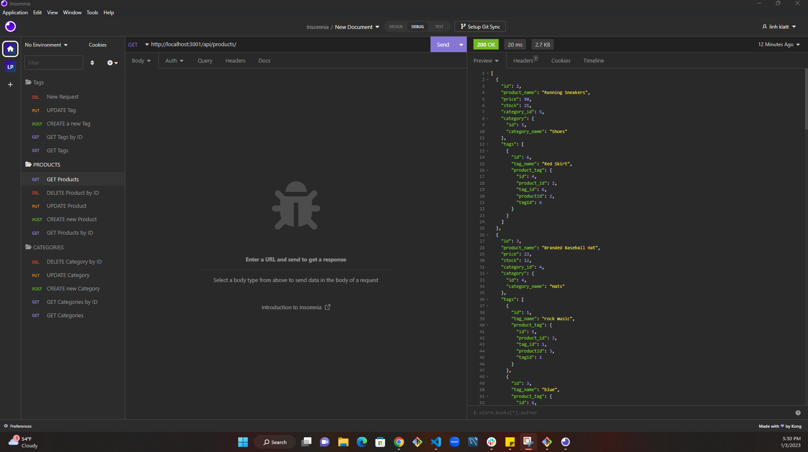

# -e-commerce-back-end

## Description

This challenge is to build the back end for an e-commerce site. You’ll take a working Express.js API and configure it to use Sequelize to interact with a MySQL database.

## Table of Contents

- [Description](#description)
- [Usage](#usage)
- [Questions](#question)

## Usage

This is the link to my video :

1. https://drive.google.com/file/d/1vhdhlPlU1_hs_QN9JlHqVwLHZOo1X18G/view

This video demonstrates how to create the schema from the MySQL shell and how to seed the database from the command line and how to start the application’s server.

2. https://drive.google.com/file/d/1bpNgVAGV-1c5g_iZH4OREmVetK9YmwJQ/view

This second video demonstrates:

GET routes for all categories, all products, and all tags being tested in Insomnia Core.

GET routes for a single category, a single product, and a single tag being tested in Insomnia Core.

POST, PUT, and DELETE routes for categories, products, and tags being tested in Insomnia Core.

This shows example of my application in Insomnia

## Question

If you have any questions about the repo, open and issue or contact me directly at linhklatt@yahoo.com. You can find more of my works at [linhklatt](email)
